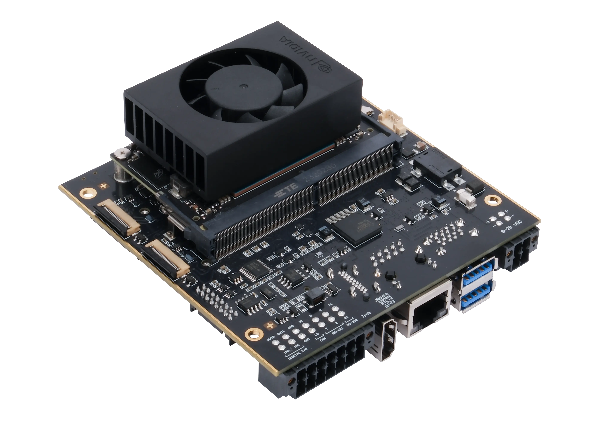
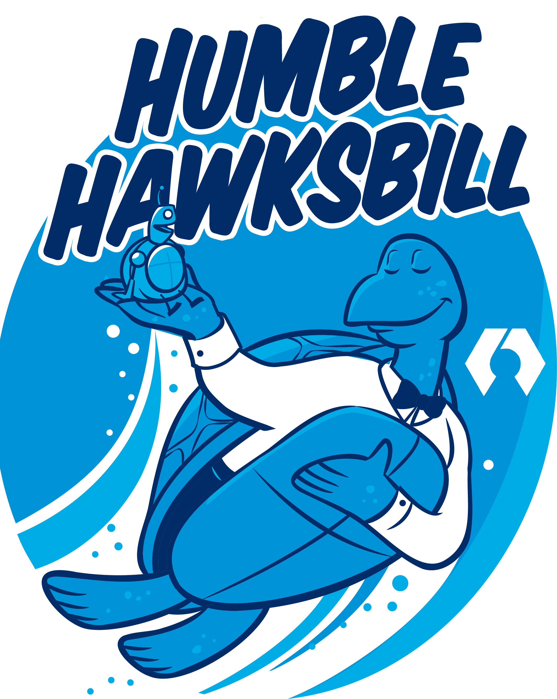
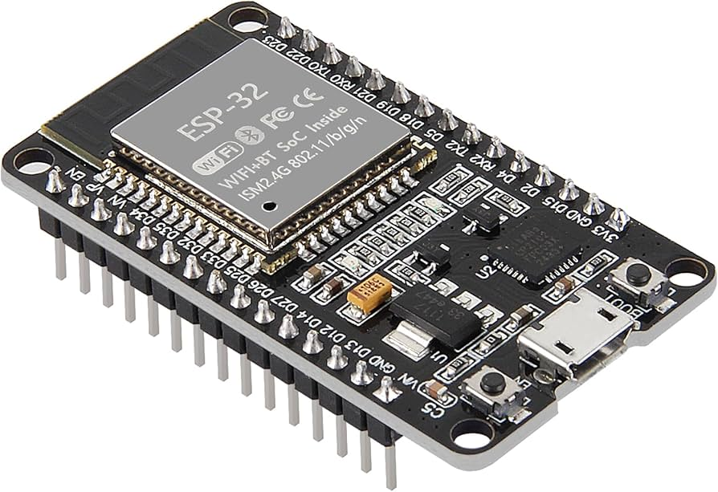

  

<h1 align="center">🚀 UHCL Lunar Hawks – NASA Lunabotics</h1>

  <strong>The official development workspace for the University of Houston–Clear Lake (UHCL) robotic lunar excavator.</strong>

  
  

  
  
  

---

## 🛰️ About the Project
This repository houses the software and electrical architecture for the **Lunar Hawks** rover, built for the [NASA Lunabotics Competition](https://www.nasa.gov/learning-resources/lunabotics-challenge/). 

The challenge requires collegiate teams to apply the **NASA Systems Engineering** process to design and build a prototype robot capable of navigating a simulated lunar environment, excavating regolith, and constructing berm structures to support future Artemis missions.

## 🤖 The Hardware
As the Systems Integration lead, I managed the interface between the high-level ROS 2 stack and the physical rover chassis.

  
   
  <em>The Lunar Hawks autonomous rover prototype featuring Jetson Orin NX and LiDAR integration.</em>

## 🛠️ System Architecture

### 🧠 High-Level Compute
* **NVIDIA Jetson Orin NX:** Primary compute module for LiDAR processing, SLAM, and autonomy.

  

### 🤖 Middleware
* **ROS 2 Humble:** Distributed architecture for navigation, sensor fusion, and inter-process communication.

  

### 🔌 Embedded Control
* **ESP32 (Micro-ROS):** Real-time motor control and sensor feedback nodes communicating over a Micro-ROS bridge.

  

---

## 📂 Repository Structure
| Directory | Description |
| :--- | :--- |
| `ros2_ws/` | Main ROS 2 workspace, navigation nodes, and custom message definitions. |
| `firmware/` | Micro-ROS firmware for ESP32 motor drivers and sensor suites. |
| `hardware/` | Pinout diagrams, electrical schematics, and PDU maps. |
| `simulation/` | URDF models and Gazebo environments for digital twin validation. |
| `docs/` | Systems Engineering Paper and technical documentation. |

## 👷 Lead Maintainer
**Matthew Garcia** *Computer Engineering Graduate (B.S. May 2026)* University of Houston–Clear Lake  
[Portfolio](https://matthew-garcia-portfolio.vercel.app/) | [LinkedIn](https://www.linkedin.com/in/matthew-garcia-165634195/)

---

Built with 💙 by the UHCL Lunar Hawks Electrical & Software Team

